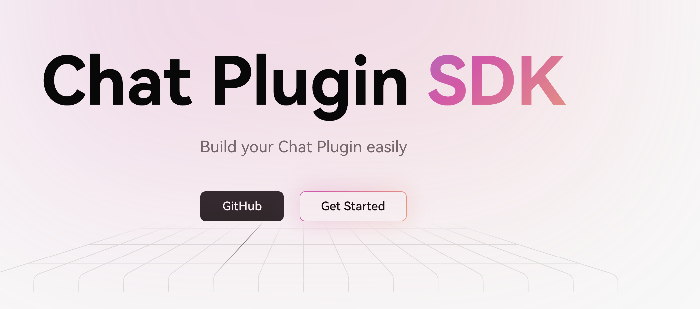
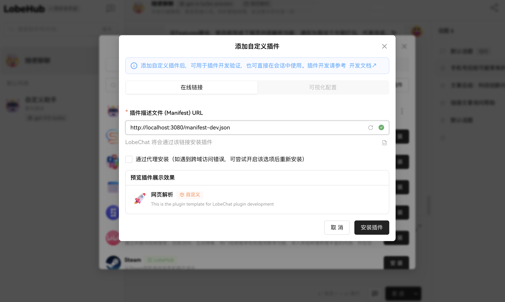

<div align="center"><a name="readme-top"></a>

<h1>LobeChat Template Plugin</h1>

---



<B>Self-use LobeChat plugin collection, unofficial</B>
</div>

---

## Introduction

This project is a personal endeavor to create my own LobeChat plugin aimed at enhancing my chat experience. The motivation behind developing this repository stems from my status as a novice in Node.js and my interest in exploring LobeChat, a popular OpenAI client. By documenting my journey and the development process, this repository serves not only as a record of my learning but also as a resource to assist other beginners in navigating their way through similar projects.

## Why This Repository?

As someone new to Node.js, diving into the development of plugins for LobeChat presented itself as a challenging yet exciting opportunity. LobeChat, being an acclaimed OpenAI client, seemed like the perfect platform for me to try my hand at plugin development. This repository is a testament to my learning journey, offering insights and learnings that I hope will benefit other novices in the field. It's a place where I document my progress, challenges, and solutions, making it a practical guide for anyone looking to embark on a similar endeavor.


## Features

- [x] **Web Content Parsing**: This feature allows for the extraction and analysis of web page content. By integrating this functionality, users can easily parse the content of any given URL, making it simpler to incorporate web data into their LobeChat experience.

## How to Use

To get started with using this plugin, please follow the steps below:

1. **Switch to the Develop Branch**

   Begin by switching to the develop branch of this repository to access the latest development features and updates.

2. **Start the Development Server**

   Use the following command to start the development server:

   ```bash
   npm run dev

3. **Integrate the Plugin with Your Custom Plugin JSON File**

      Once the development server is running, you can integrate this plugin into your LobeChat environment. To do so, you will need to specify the path to the plugin's manifest file in your custom plugin configuration. For web content parsing, for example, you can use:

    ```plain text
    http://localhost:3080/manifest-dev.json
    ```
   

Replace the URL with the appropriate path where your development server is running and the plugin's manifest file is accessible.

By following these steps, you should be able to seamlessly integrate and start using the plugin with LobeChat to enhance your chat experience.

<B>This section provides clear and concise instructions on how to use your plugin, tailored to your requirements. Feel free to adjust any part of it to better fit your project's setup or naming conventions.</B>

---

## HELP WANTED
As someone new to Docker, I initially managed to build a Dockerfile that worked perfectly. However, as I continue to commit code, I can't guarantee that these changes won't affect the deployment of the Docker image. If you have a solid understanding of Docker and are willing to offer assistance, I would greatly appreciate your contact. Your expertise could be invaluable in ensuring smooth deployments going forward.


## License

[Mit License](./LICENSE)

## Acknowledgments

[develop-doc](https://chat-docs.lobehub.com/zh/usage/plugins/development)
